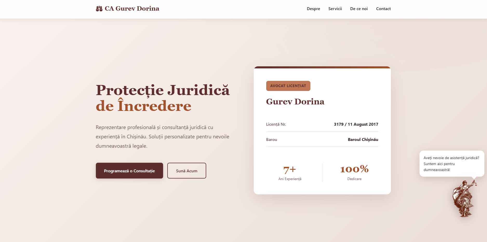
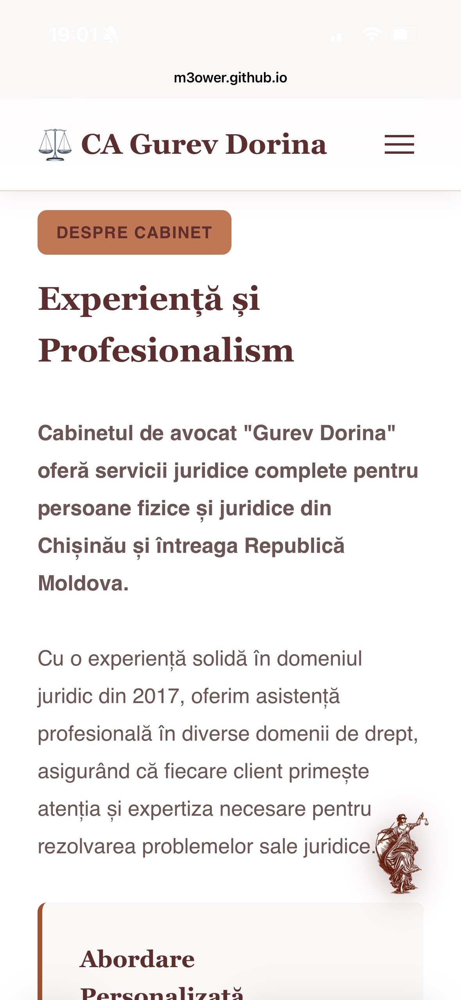

# Cabinet Avocat Gurev Dorina

A professional, fully responsive landing page for a law office in Chișinău, Moldova. Built with HTML, CSS, and TailwindCSS featuring an animated Lady Justice mascot and mobile-optimized design.

## Live Demo

🔗 **[View Live Site](https://m3ower.github.io/pw-lab2/)** 

## Description

This is a fully responsive single-page website for Cabinet Avocat Gurev Dorina, featuring:
- **Fully Responsive Design**: Optimized for desktop, tablet, and mobile devices with breakpoints at 768px and 480px
- **Mobile-Only Quick Contact Bar**: Fixed bottom bar visible only on mobile devices with direct call, email, and form links
- **Animated Mascot**: Lady Justice character that appears after 2 seconds with continuous bounce animation and interactive hover tooltip
- **Legal Services**: Comprehensive overview of practice areas (Civil, Family, Commercial, Real Estate, Labor Law, Court Representation)
- **Contact Form**: Easy-to-use form for consultation requests
- **Professional Design**: Burgundy/brown color scheme conveying trust, elegance, and legal authority

## Lab 3 Features

### ✅ Responsive Design (5 Points)

**All Elements Adjusted for Desktop/Mobile**
- Breakpoints at 768px (tablet) and 480px (mobile)
- Grid layouts collapse to single column on mobile
- Typography scales: Hero title from 3.5rem (desktop) to 1.75rem (mobile)
- Navigation transforms to hamburger menu on mobile
- All sections stack vertically on smaller screens

**Call-to-Action Visible on Mobile**
- Hero section CTAs: "Programează o Consultație" and "Sună Acum" buttons
- Both prominently displayed and stacked on mobile devices
- Mobile contact bar provides additional quick-access CTAs

**Mobile-Only Element**
- **Quick Contact Bar**: Fixed bottom bar with 3 action buttons (Sună, Email, Formular)
- Hidden on desktop screens (>768px)
- Always visible on mobile (<768px)
- Built with TailwindCSS utility classes

### Mascot Implementation

**Related to Topic**
- Lady Justice image - iconic symbol of law and justice
- Directly relevant to law office branding

**Friendly/Pleasant Design**

**Delayed Appearance on Corner**
- Appears after 2-second delay
- Slides in from right side

**Animated**
- Continuous bounce animation (mascotBounce)
- Smooth up-down movement every 2 seconds

**Hover Message**
- Tooltip appears on hover: "Aveți nevoie de asistență juridică? Suntem aici pentru dumneavoastră!"
- Smooth fade-in/fade-out transition
- Speech bubble design with pointer arrow
- Positioned above mascot

###CSS Framework Integration

**TailwindCSS via CDN**
- Added in `<head>`: `<script src="https://cdn.tailwindcss.com"></script>`
- Custom burgundy colors configured in Tailwind config:
  ```javascript
  colors: {
    burgundy: {
      dark: '#3d1f1f',
      DEFAULT: '#5c2e2e',
      light: '#7a3e3e',
    },
    sienna: {
      DEFAULT: '#a0522d',
      light: '#c07854',
    }
  }
  ```
- **Mobile contact bar built 100% with Tailwind classes**:
    - `hidden max-md:flex` - Hide on desktop, show on mobile
    - `fixed bottom-0 left-0 right-0` - Fixed positioning at bottom
    - `bg-burgundy p-4 shadow-lg z-50` - Styling
    - `flex gap-2` - Flexbox layout
    - No custom CSS needed for the mobile bar - pure Tailwind utility classes

## Technologies Used

- **HTML5**: Semantic markup
- **CSS3**: Custom properties, Grid, Flexbox, animations, media queries
- **TailwindCSS**: Utility-first CSS framework via CDN for mobile components
- **Google Fonts**: Playfair Display (serif) & Source Sans Pro (sans-serif)


### Mobile Enhancements
- Quick contact bar (Sună, Email, Formular)
- Stacked layouts for better readability
- Touch-friendly button sizes
- Optimized typography scaling


---

## Screenshots

### Desktop


### Mobile


